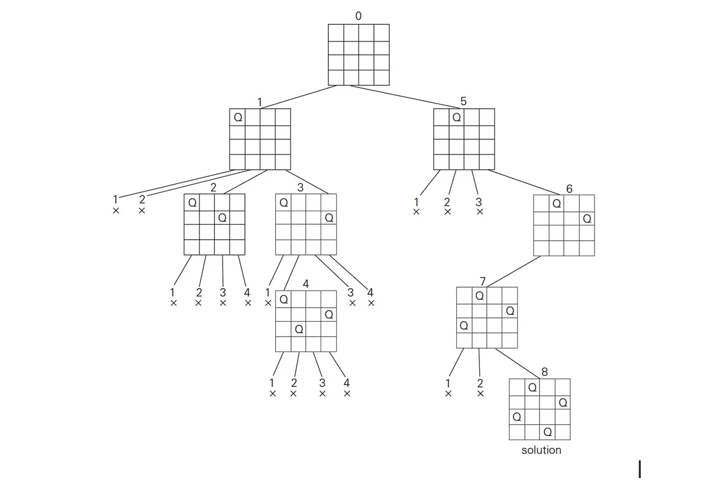

# Back Tracking

### Key Point
1. 필요 없는 경우를 가지치기 (pruning) 하여 O() 감소

## 예시 문제 - N-Queen
```python
def nqueen(n) :

    answer = []

    # 모든 경우 탐색, 퀸을 두면 다음 퀸을 두는 데 영향 => DFS
    # 퀸을 둔 후 다음 퀸을 둘 때 pruning 할 수 있음 (1,1) 에 두면 (1, n) or (m, 1) 에 다 넣을 수 있음
    # 단 하나의 행에 하나의 퀸만 존재 가능 == 1 행 3 열 -> checked[1] = 3
    checked = [-1] * n # 퀸을 두는 것, 총 n 개 들어감

    def is_ok(row) :
        # 새로 둔 퀸이 이미 있는 퀸들과 부딪히지 않는지 확인
        # 한 행에 한 퀸, 열 번호 확인, 대각선 확인(x y 거리 같음) => 상하좌우 대각선 체크
        for x in range(row) :
            if checked[x] == checked[row] or abs(x - row) == abs(checked[x] - checked[row]) :
                return False # pruning
        return True

    def dfs(row) :
        if row >= n :
            result = [["."] * n for _ in range(n)]
            for x in range (n) :
                result[x][checked[x]] = "Q"

            answer.append(["".join(result[idx]) for idx in range(n)])

            return

        for c in range(n) :
            checked[row] = c
            if is_ok(row) :
                dfs(row+1)

    dfs(0)

    return answer

```