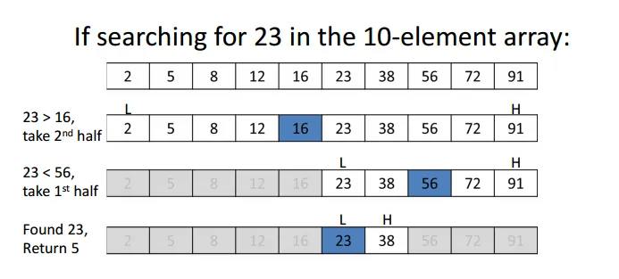

# Binary Search

### Key Point
1. 정렬된 배열에서, 찾는 범위를 절반씩 줄여나가면서 탐색
2. 조건 - 배열이 정렬되어 있어야 함
3. O(log n) // 찾고자 하는 데이터 n


## 예시 문제 - 이진 검색
```python
def binary_search(nums, target) :

    def bs (start, end) :
        if start > end :
            return -1
        mid = (start + end) // 2
        if target == nums[mid] :
            return mid
        elif target < nums[mid] :
            return bs(start, mid - 1)
        else :
            return bs(mid + 1, end)

    return bs(0, len(nums) -1)
```