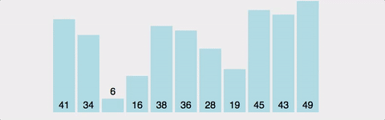

# Bubble Sort

## Buuble Sort 구현하기
### Key Point
1. 앞에서부터 순서대로 2개씩 비교해서 큰 데이터를 뒤로
2. 맨 마지막을 제외, 1. 부터 다시 시작하여 배열 끝까지 반복
   - 맨 마지막엔 해당 차수의 가장 큰 데이터가 위치
```python
def bubblesort (arr) :
    for n in range (len(arr) -1) :
        for current in range (len(arr) - 1 - n) :
            if arr[current] > arr[current+1] :
                arr[current], arr[current+1] = arr[current+1], arr[current]

    return arr
```