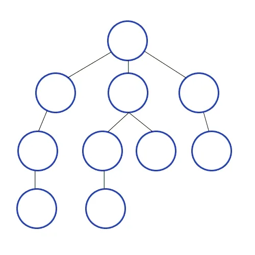

# DFS
Depth First Search

## DFS 구현하기
### Key Point
1. 시작 노드에서 출발하여 가장 깊은 경로로 탐색, 더 이상 탐색할 경로가 없으면 이전 분기점으로 되돌아감  
   1. 시작 노드에서 출발  
   2. 현재 방문한 노드를 visited에 추가 (재방문 방지)
   3. 현재 방문한 노드와 인접한 노드 중 not in visited 노드 방문
   4. ii 부터 반복
2. O(노드 + 간선)
3. 용도
   - 경로 탐색 (특정 조건)
   - 사이클
   - 연결 요소 개수
   - 미로 문제
   - 위상 정렬

- recursive
```python
def dfs_recursive(graph, node, visited) :
    visited.append(node)

    for adjacent in graph[node] :
        if adjacent not in visited :
            dfs_recursive(graph, adjacent, visited)

    return visited
```

- stack
```python
def dfs_stack(graph, start):
    visited = []
    stack = [start] # 방문해야 하는 노드의 목록

    while stack :
        node = stack.pop()
        visited.append(node)

        for adjacent in graph[node] :
            if adjacent not in visited :
                stack.append(adjacent)

    return visited
```

## 예시 문제 - 섬의 개수
- recursive
```python
def island_dfs_recursive (grid) :
    count = 0
    rows = len(grid)
    cols = len(grid[0])

    def dfs_recursive (r, c) :

        direction_row = [-1, 1, 0, 0]
        direction_col = [0, 0, -1, 1]

        if r < 0 or r >= rows or c < 0 or c >= cols or grid[r][c] != "1" :
            return

        grid[r][c] = "0"

        for i in range(4) :
            nr = r + direction_row[i]
            nc = c + direction_col[i]
            dfs_recursive(nr, nc)
        return


    for r in range (rows) :
        for c in range (cols) :
            if grid[r][c] != "1" :
                continue

            count += 1 # new island
            dfs_recursive(r,c)
            
    return count
```
- stack
```python
def island_dfs_stack(grid) :

    direction_row = [-1, 1, 0, 0]
    direction_col = [0, 0, -1, 1]
    count = 0

    rows = len(grid)
    cols = len(grid[0])

    for r in range (rows) :
        for c in range (cols) :
            if grid[r][c] != "1" :
                continue

            count += 1 # new island
            stack = [(r, c)]
            while stack : # DFS
                x, y = stack.pop()
                grid[x][y] = "0"
                for i in range(4) :
                    nx = x + direction_row[i]
                    ny = y + direction_col[i]
                    if nx < 0 or nx >= rows or ny < 0 or ny >= cols or grid[nx][ny] != "1" :
                        continue

                    stack.append((nx, ny))

    return count

```