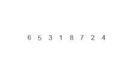

# Merge Sort

## Merge Sort 구현하기
### Key Point
1. 일단 쪼개기! (쪼개져 있을 수도 있음)
2. 쪼개진 집합을 정렬을 유지 하면서 합치기
```python
def mergesort(arr) :
    
    def merge(arr1, arr2) :
        result = []
        i, j = 0, 0
        while i < len(arr1) and j < len(arr2) :
            if arr1[i] < arr2[j] :
                result.append(arr1[i])
                i += 1
            else :
                result.append(arr2[j])
                j += 1

        for idx in range(i, len(arr1)) :
            result.append(arr1[idx])
        for idx in range(j, len(arr2)) :
            result.append(arr2[idx])

        return result

    if len(arr) <= 1 :
        return arr

    mid = len(arr) // 2
    left = arr[:mid]
    right = arr[mid:]

    return merge(mergesort(left), mergesort(right))
```