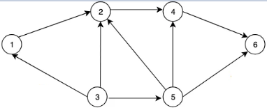
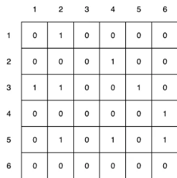
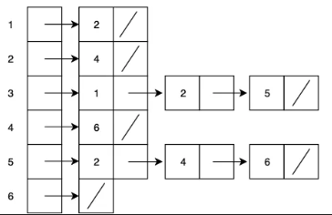

# Graph

## Graph 구현하기
### Key Point
1. 연결 관계 표현 : 정점(노드), 정점(노드)간의 관계 표현
   - Node : 연결 관계를 가진 각 데이터, 정점
   - Edge : 노드 간의 관계를 표시한 선
   - Adjacent Node (인접 노드) : 간선으로 직접 연결된 노드
2. 종류
   - Directed Graph
   - Undirected Graph
3. 구현 방법
   - Adjacency Matrix (인접 행렬) - 2차원 배열  
      
     - ```python
       graph = [
       [False, True, False, False, False, False],
       [False, False, False, True, False, False],
       [True, True, False, ...],
       [...],
       [...],
       [...]]
       ```
     - 공간 복잡도 O(노드 ^ 2)
   - Adjacency List (인접 리스트) - 딕셔너리  
      
     - ```python
       graph = {
          1 : [2],
          2 : [4],
          3 : [1,2,5],
          4 : [6],
          5 : [2,4,6],
          6 : [],
       }
       ```
     - 시간 복잡도 O(간선), 공간 복잡도 O(노드 + 간선)
   