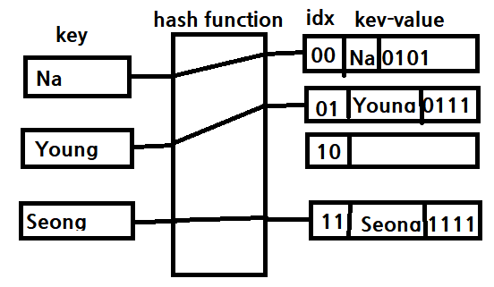

# Hash Table

## Hash Table 구현하기
### Key Point
1. 해시함수를 이용하여 key - value 매핑 구조
2. 해시함수
   - 임의 크기 데이터를 고정 크기 값으로 매핑
     - e.g. 나머지를 반환하는 함수
3. 충돌
    - Chaning 연결
      - 메모리 오버헤드
      - python
    - Open Addressing 빈 공간 찾기
      - 클러스터링 문제
      - c++, Java, Go
```python
class HashNode :
    def __init__(self, key, val, next):
        self.key = key
        self.val = val
        self.next = next

class HashTable :
    def __init__(self):
        self.size = 10
        self.table = [None] * self.size

    def _hash_function(self, key):
        return key % self.size


    def put(self, key, val):
        idx = self._hash_function(key)

        if self.table[idx] is None :
            self.table[idx] = HashNode(key, val, None)
        else :
            node = self.table[idx]
            while node.next :
                node = node.next
            node.next = HashNode(key, val, None)

    def get(self,key):
        idx = self._hash_function(key)
        node = self.table[idx]

        while node is not None:
            if node.key == key :
                return node.val
            node = node.next
        return -1


    def remove(self, key) :
        idx = self._hash_function(key)
        node = self.table[idx]
        prev_node = None

        while node is not None :
            if node.key == key :
                if prev_node is None :
                    self.table[idx] = node.next
                else :
                    prev_node.next = node.next
                return
            prev_node = node
            node = node.next

```


### 예시 문제
```python

```