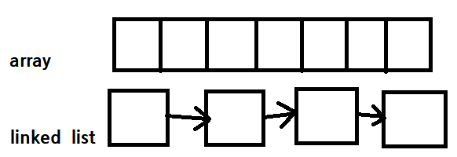
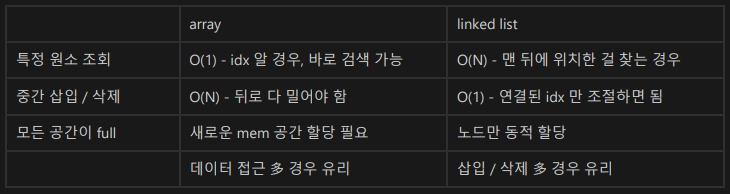

# Linked List




## Linked List 구현하기
### key point
1. 각 노드는 값을 가진다
2. 각 노드는 다음 가르키는 노드 정보를 가진다.
   - 끝 노드의 next = `None`
3. LinkedList 는 head 노드 정보를 가진다.
   - head 는 첫번째 노드
4. 선형 구조
   - 용도 : 자료 꺼내고 넣기

```python

class LinkedNode () :
    def __init__ (self, val=0, next=None) :
        self.val = val
        self.next = next

class LinkedList () :
    def __init__ (self):
        self.head = None
        
    def append(self, val):
        if self.head == None :
            self.head = LinkedNode(val)
            return 
        
        node = self.head
        while node.next :
            node = node.next
            
        node.next = LinkedNode(val)

```


## 예시 문제 - Palindrome
```python
def isPalindrome (linkedList) :

    node = linkedList.head
    array = []

    if not node :
        return True

    while node :
        array.append(node.val)
        node = node.next

    while len(array) > 1 :
        first = array.pop(0)
        last = array.pop()
        if first != last :
            return False

        return True

```