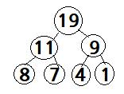

# Max Heap

## Max Heap 구현하기
### Key Point
1. 완전 이진 트리
   - 최대 값과 최소 값을 빠르게 찾음
   - Max Heap 최대 힙 : Parent Node > Child Node
   - Min Heap 최소 힙 : Parent Node < Child Node
2. 삽입
    - O(log N) : tree 의 height
   1. 맨 끝으로 삽입
   2. Parent 와 값 비교
   3. Parent 보다 크면 자리 바꾸기
   4. Parent 보다 작거나 Root 도달할 때까지 2,3 반복 
3. 추출
   - 최대 값 즉, root 삭제
   - O(log N) : tree 의 height
   1. root 와 맨 끝 Node 교체
   2. 맨 끝 Node pop (return 을 위해 저장)
   3. 새로 올라온 root 와 left / right Child 비교
   4. Child 보다 작으면, 바꾸면서 Max Heap 유지
   5. 가장 아래 level 에 도달할 때까지 3,4 반복
   6. 맨 끝 Node return
```python
class BinaryMaxHeap :
    def __init__(self):
        self.items = [None]

    def insert(self, val):
        self.items.append(val)

        currentIdx = len(self.items) - 1
        parentIdx = currentIdx // 2

        while parentIdx > 0 :
            if self.items[currentIdx] > self.items[parentIdx] :
                self.items[currentIdx], self.items[parentIdx] = self.items[parentIdx], self.items[currentIdx]

                currentIdx = parentIdx
                parentIdx = currentIdx // 2

    def extract(self, val):

        if len(self.items ) < 2 :
            return None

        root = self.items[1]
        self.items[1] , self.items[-1] = self.items[-1] , self.items[1]
        self.items.pop()

        self._percolate_down(1)

        return root

    def _percolate_down(self, currentIdx):
        biggestIdx = currentIdx
        leftIdx = currentIdx * 2
        rightIdx = currentIdx * 2 + 1

        if leftIdx < len(self.items) and self.items[leftIdx] > self.items[biggestIdx] :
            biggestIdx = leftIdx
        if rightIdx < len(self.items) and self.items[rightIdx] > self.items[biggestIdx] :
            biggestIdx = rightIdx
        if biggestIdx != currentIdx :
            self.items[biggestIdx], self.items[currentIdx] = self.items[currentIdx], self.items[biggestIdx]
            self._percolate_down(biggestIdx)
```