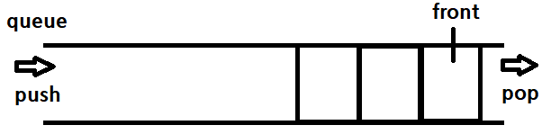

# Queue


## queue 구현하기
### key Point
1. FIFO : First In First Out
2. front : 가장 오래된 노드
3. push / pop

```python
class Node:
    def __init__(self, val=0, next=None):
        self.val = val
        self.next = next

class Queue :
    def __init__(self):
        self.front = None

    def push(self, val):
        if self.front is None :
            self.front = Node(val)
            return

        node = self.front
        while node.next :
            node = node.next

        node.next = Node(val)

    def pop(self):
        if self.front is None :
            return None

        currentFront = self.front
        self.front = currentFront.next
        return currentFront.val


    def isEmpty(self):
        return self.front is None
```

## 예시 문제 - 줄서기
```python

```

## python - deque
```python
from collections import deque

deq = deque([i for i in range(1, n+1)]) # [1, 2, .. n]

deq.append() # right 로 넣기
deq.extend() # right 로 넣기
deq.appendleft() #left 로 넣기
deq.extendleft() # left 로 넣기

deq.pop() # right 에서 빼기
deq.popleft() # left 에서 빼기

```