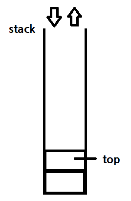

# Stack


## stack 구현하기
### Key Point
1. LIFO (Last In First Out)
   - 함수 호출 기록 저장, 수식 괄호 검사, 백트래킹 등 활용
2. top : stack 의 마지막 노드
3. push / pop

```python
class StackNode:
    def __init__(self, val=0, next=None):
        self.val = val
        self.next = next

class Stack:
    def __init__(self):
        self.top = None

    def push(self, val):
        newTop = StackNode(val)
        newTop.next = self.top
        self.top = newTop

        ''' short ver
        self.top = StackNode(val, self.top)
        '''


    def pop(self):
        if not self.top:
            return None

        currentTop = self.top
        self.top = currentTop.next
        return currentTop.vl


    def isEmpty(self):
        return self.top is None
```

## 예시 문제 - 유효한 괄호
```python

```

## python - list 로 stack