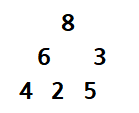

# Tree

## Tree 구현하기
### Key Point
1. 비선형 구조
   - 계층적 or 망 구조
   - 용도 : 표현에 초점
2. 용어
    - Node
    - Root Node : tree 맨 위 노드
    - Level : 최상위 노드 level 0, 1씩 증가
    - Depth : tree 에서 노드가 갖는 가장 최대 Level
    - Parent Node / Child Node / Sibling Node
    - Leaf Node : Child Node 가 0 인 마지막 Node
3. 트리 종류
   - Binary Tree (이진 트리) : child node 0 or 1 or 2
   - Complete Binary Tree (완전 이진 트리) : 노드 삽입 시 최하단 왼쪽 노드부터 차례대로 삽입
4. 완전 이진 트리 - 배열 구현
   - left child : current idx * 2  
   - right child : current idx * 2 + 1  
   - parent : current idx // 2
   - height : h = log_2(N+1) - 1 => O(log N)
   - 모든 노드가 꽉 찬 완전 이진트리의 모든 Node 개수 : N = 2^(h+1) - 1
   - e.g. 
      - Level 0 -> `[None, 8]`
      - Level 1 -> `[None, 8, 6, 3]`
      - Level 2 -> `[None, 8, 6, 3, 4, 2, 5]`  
